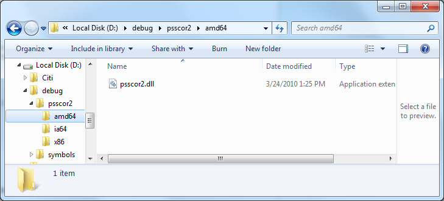
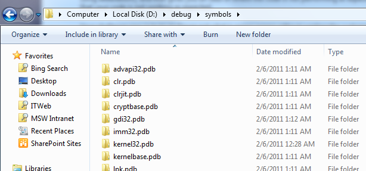
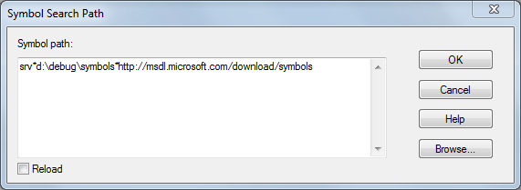
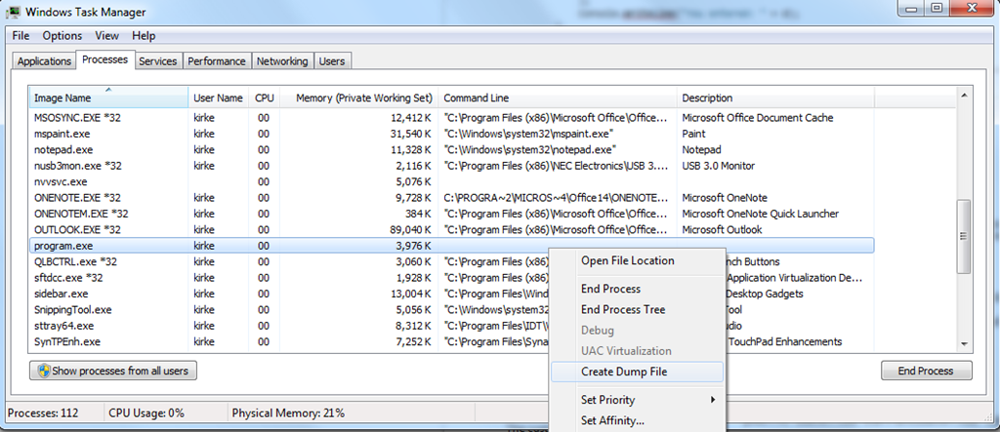
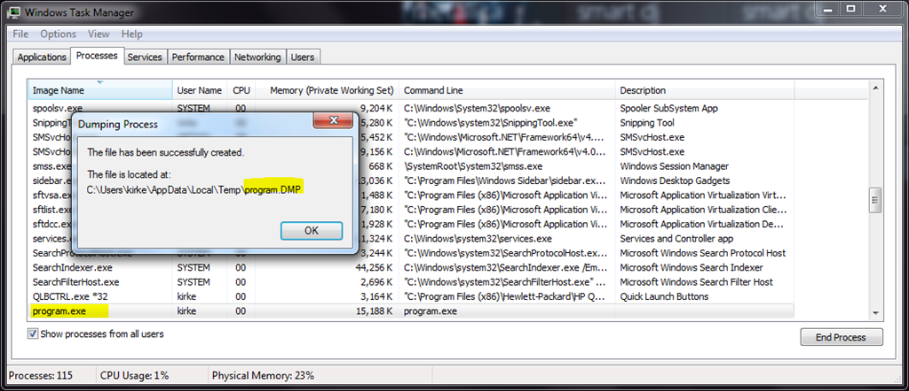
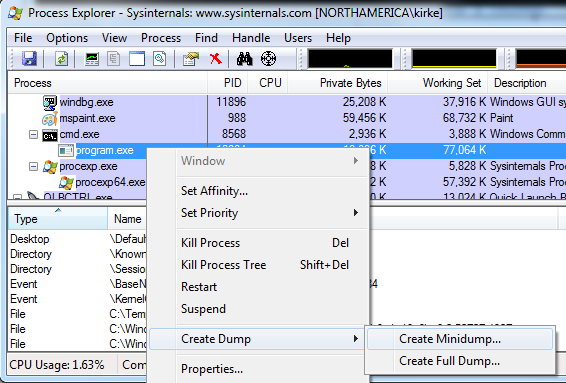
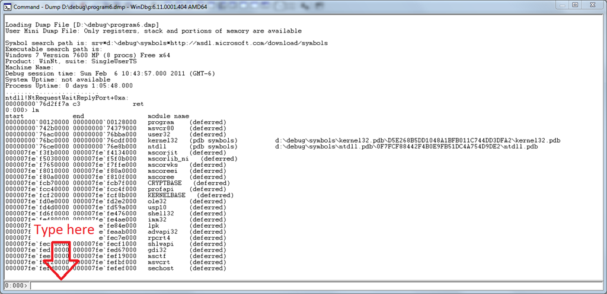
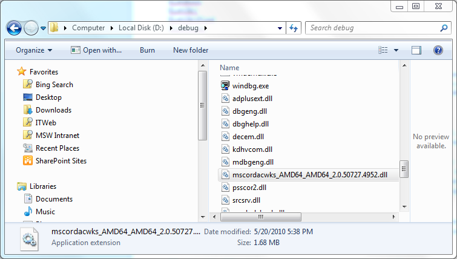

# Intro to WinDBG for .NET Developers

April 11, 2011

When your code goes into production, you usually no longer have access to its binaries when they reach their final destination.  Whether that is someone’s desktop or a set of servers, you no longer have access to directly observe your code and its environment.  Operating system patches are applied, network policies are changed, firewall rules are restricted, disks are configured… as your code lives its life in its new home, there’s a wide range of things that may change in its environment and affect how it behaves (or rather misbehaves).  You liberally littered your code with lines of logging logic to learn in these lulls (long alliteration!), and that gives you an idea of where the code is not performing as expected, but you still are unaware of the exact reason (and thus, the fix) that your code is not working as expected.

Your challenge now is to try to figure out what is going wrong without wasting the customer’s time doing troubleshooting, because there’s nothing that a business user loves more than being asked by a technical guy which button is he really clicking to get that error.  You don’t have the luxury (should have thrown that in the alliteration sentence previously) of spending days or weeks doing troubleshooting, you need to know what is happening right now.

In a perfect world, you would have the stack trace, you’d be able to inspect locals, you could debug the code.  Well, it turns out, you can do just that… and never attach to the customer’s environment.

## Download WinDbg and Get Started

[http://www.microsoft.com/whdc/DevTools/Debugging/default.mspx](Download the Debugging Tools for Windows) to your local developer machine.  You can get them as part of the Windows SDK.  Choose the Debugging Tools for Windows in the Common Tools section if you only want the debugging tools for your current machine’s platform.  If it is an x86 machine, then only the x86 tools are installed.  If your machine has an Intel 64-bit processor, then only the x64 tools are installed.  If you choose the redistributable version, then you get all three (x86, x64, and Itanium).   After you download, install to your local developer machine (not the customer’s machine).

One tip is to change the installation path.  By default, windbg will be copied to the Program Files directory.  Instead, change the path to something like "d:\debug". This will make it easier to add extensions.

Now that you’ve installed, in the start menu you will see a new program group, "Debugging Tools for Windows (x64)", and a new program in it called "WinDbg". 

## Install PssCor2

The next step is to install the extensions for managed code.  By default, WinDbg is a tool designed for unmanaged code debugging, but an extension ships with the .NET Framework called SOS.dll that enables managed code debugging.  An additional WinDbg extension called PssCor2 has been created that is a superset of SOS and provides additional functionality for managed code developers.  This extension will allow you to inspect managed threads, the managed object heap, and inspect the CLR stack, among other things.  Download PssCor2 and unzip it. 

I unzipped PssCor2 to my "d:\debug" directory, this will make it much easier to use as you will see later in this post.



Another tip: copy the psscor2.dll file and copy it to the d:\debug directory where windbg.exe resides.  This will make loading the extension much easier for you.

## Set Your Symbol Path

Have you ever noticed the .PDB file that is generated in your program’s bin/debug folder when you compile in Visual Studio?  This is the file that contains debugging symbols for your assembly.  It does not contain instructions or executable code, but rather provides the ability for a debugger to translate your compiled code’s instructions into something you can read.  Microsoft provides a set of symbols on a public server for your debugger program to use.  These symbols are located at [http://msdl.microsoft.com/download/symbols](http://msdl.microsoft.com/download/symbols).

The symbols will be downloaded from Microsoft and cached locally on your machine.  Choose a path to store the symbols.  For instance, I store mine at "d:\debug\symbols".  After you use WinDBG, you will see the symbols downloaded to your machine.



Now that you understand the symbols are downloaded and cached locally, here’s the first tricky part: setting your symbol path in WinDbg.  Start WinDbg, and on the File menu choose "Symbol File Path…"  Specify your symbol path using the following syntax:

`srv*d:\debug\symbols*http://msdl.microsoft.com/download/symbols`

Lest you think this is a misprint or you are having problems getting this to work, here’s exactly what’s in my symbol path.



I prefer to keep everything (symbols, extensions, dump files) under a single folder at the root of a drive (for instance, "d:\debug") because it is easier to locate all the pieces when you need them.

## Create a Problem

To get started, we’ll need some code to work with.  I’ll use a simple Console application.

````csharp
using System;

namespace Microsoft.PFE.Samples
{
    public class Program
    {
        static void Main()
        {
            Console.WriteLine("Enter a message:");
        string input = Console.ReadLine();
            Data d = new Data
            {
                ID = 5,
                Message = input,
                CurrentDateTime = System.DateTime.Now
            };
            Console.WriteLine("You entered: " + d);
        }
    }

    public class Data
    {
        public int ID {get; set;}
        public string Message {get; set;}
        public DateTime CurrentDateTime {get; set;}


        public override string ToString()
        {
            Console.ReadLine();
            return string.Format("ID:{0} {1} at {2}", ID, Message, 

CurrentDateTime.ToLongTimeString());
        }
    }
}
````

You can see that this is an over-glorified "echo" program.  I compile the program using CSC.exe, making sure we are using the version of CSC from Windows SDK 7.0, which is the .NET Framework 3.5 version. 

`csc.exe Program.cs`

PssCor2 works with the .NET 3.5 framework, so if you are compiling with Visual Studio, then change the framework version to 3.5 before compiling.  Run the program and enter a string to see the program work correctly.  There is also a PssCor4.dll, which works with .NET 4.0. [Update 4/13/2011 – thanks to an astute reader for pointing out PssCor4 is not available]

The customer’s complaint is that they have to hit enter twice in the Console window and cannot figure out why.  Our program is doing something we didn’t intend, so let’s see what’s going on.  Of course, for our contrived example, we know that it’s because of the second Console.ReadLine that was mistakenly placed in the ToString method of the Data class, so let’s use WinDbg to find it. 

Run the program and enter a string, but do not hit Enter at the second ReadLine prompt.  We are now at the point that we want to capture what’s happening, and we can do this in a dump file.

## Take a Dump

Rather than try to remote desktop into a customer’s machine or worse, asking them to install Visual Studio so you can do some debugging, you can have them capture a dump of the process so that you can debug it later.  Windows 7 and Windows 2008 have this great feature for capturing dumps from a process using Task Manager.  To see what’s going on in the customer’s environment without asking them to install utilities, just have them start Task Manager (either from Control Panel or using Ctrl + Alt + Del).  Find the process, right-click, and choose "Create Dump File".



After we create the dump file, we see the following message:




The dump file is just a snapshot of memory. However large the dump file is on disk is the size of the memory used for the process.  You can zip the file to significantly reduce its size, and download it to your machine for offline analysis.

There are other ways to create a dump file.  The one we created is a full dump, and its size is 74.9 MB (just for our small Console application).  You can use other tools to create a dump.  For instance, I like to use Process Explorer from SysInternals to capture a dump (using the Full Dump option generates the same thing as right-clicking a process in Task Manager).



Other tools used to create dumps include using ADPlus (included in the Debugging Tools for Windows), or even DebugDiag.  Using DebugDiag lets you create rules for when dumps are captured, such as when a particular exception is raised.  This can be very helpful for grabbing a snapshot of memory as the error occurs so that you can troubleshoot errors in ULS logs in SharePoint.

## Start Exploring with WinDbg

Now that we have a dump file to debug, we go back to WinDbg and start exploring.  From the file menu, choose "File / Open Crash Dump" to open the dump file in WinDbg.  As soon as you open it, you should see text:

````
Loading Dump File [D:\debug\program6.dmp]
User Mini Dump File: Only registers, stack and portions of memory are available

Symbol search path is: srv*d:\debug\symbols*http://msdl.microsoft.com/download/symbols
Executable search path is: 
Windows 7 Version 7600 MP (8 procs) Free x64
Product: WinNt, suite: SingleUserTS
Machine Name:
Debug session time: Sun Feb  6 10:43:57.000 2011 (GMT-6)
System Uptime: not available
Process Uptime: 0 days 1:05:48.000
.........................
ntdll!NtRequestWaitReplyPort+0xa:
00000000`76d2ff7a c3              ret
````

Inside that text, you can see the path for the dump file and the symbol search path.  At the bottom of the screen is a text box where you will enter commands.



## List Modules

Let’s start by listing the modules that were loaded in the process when the dump file was created.  In the text box at the bottom of the dump window, type "lm" to list the modules.  The output looks like this:

````
0:000> lm
start             end                 module name
00000000`00120000 00000000`00128000   program    (deferred)             
00000000`742b0000 00000000`74379000   msvcr80    (deferred)             
00000000`76ac0000 00000000`76bba000   user32     (deferred)             
00000000`76bc0000 00000000`76cdf000   kernel32   (pdb symbols)          d:\debug\symbols\kernel32.pdb\D5E268B5DD1048A1BFB011C744DD3DFA2\kernel32.pdb
00000000`76ce0000 00000000`76e8b000   ntdll      (pdb symbols)          d:\debug\symbols\ntdll.pdb\0F7FCF88442F4B0E9FB51DC4A754D9DE2\ntdll.pdb
000007fe`f3fb0000 000007fe`f4134000   mscorjit   (deferred)             
000007fe`f5030000 000007fe`f5f0b000   mscorlib_ni   (deferred)             
000007fe`f7650000 000007fe`f7ffe000   mscorwks   (deferred)             
000007fe`f8010000 000007fe`f80a0000   mscoreei   (deferred)             
000007fe`f80a0000 000007fe`f810f000   mscoree    (deferred)             
000007fe`fcb70000 000007fe`fcb7f000   CRYPTBASE   (deferred)             
000007fe`fcc40000 000007fe`fcc4f000   profapi    (deferred)             
000007fe`fcf20000 000007fe`fcf8b000   KERNELBASE   (deferred)             
000007fe`fd0e0000 000007fe`fd2e2000   ole32      (deferred)             
000007fe`fd4d0000 000007fe`fd59a000   usp10      (deferred)             
000007fe`fd6f0000 000007fe`fe476000   shell32    (deferred)             
000007fe`fe480000 000007fe`fe4ae000   imm32      (deferred)             
000007fe`fe840000 000007fe`fe84e000   lpk        (deferred)             
000007fe`fe9d0000 000007fe`feaab000   advapi32   (deferred)             
000007fe`feb50000 000007fe`fec7e000   rpcrt4     (deferred)             
000007fe`fec80000 000007fe`fecf1000   shlwapi    (deferred)             
000007fe`fed00000 000007fe`fed67000   gdi32      (deferred)             
000007fe`fee10000 000007fe`fef19000   msctf      (deferred)             
000007fe`fef20000 000007fe`fefbf000   msvcrt     (deferred)             
000007fe`fefd0000 000007fe`fefef000   sechost    (deferred)  
````

The thing you are looking for here is the existence of mscorwks for a .NET 3.5 application.  PssCor2 works with .NET 3.5.  If you have a .NET 4.0 process that you want to debug, you can do this as well, but you need to use the SOS.dll extension that ships with the .NET Framework.  For an interesting look at changes introduced in .NET 4.0, see [http://debuggingblog.com/wp/2009/07/07/windbg-extension-sos-in-clr-40net-framework-40-ctp-net-runtime-dll-renamed-and-sos-commands-just-got-richer/](http://debuggingblog.com/wp/2009/07/07/windbg-extension-sos-in-clr-40net-framework-40-ctp-net-runtime-dll-renamed-and-sos-commands-just-got-richer/). 

For SharePoint developers, this can be an invaluable tool for debugging things like feature receivers and event handlers that never seem to fire.  You can list the loaded modules to see if your assembly is ever loaded into memory.  If it’s not, then you most likely have a configuration issue, significantly limiting the number of places to go searching for things to fix.  For ASP.NET developers, this can be extremely helpful in figuring out why an HttpModule is not firing, indicating the most likely problem is in the web.config file. 

## Load PssCor2

OK, we saw the modules that are loaded, let’s dive into our code a little and see what we can discover.  Remember that we have an extension for WinDbg that we need to load.  To load PssCor2.dll as an extension into WinDbg, use the following command:

`.load d:\debug\psscor2\amd64\psscor2.dll`

My machine is a 64-bit Intel machine, so I will load the AMD64 version of PssCor2.dll.  The version you are debugging with and the architecture of the dump that you are debugging must match.  If you are debugging an x86 process, you need to load the x86 version of PssCor2.dll. 

To verify it was loaded, type the following command:

`!help`

The output of this is:

````
0:000> .load d:\debug\psscor2\amd64\psscor2.dll
0:000> !help
-------------------------------------------------------------------------------
PSSCOR is a debugger extension DLL designed to aid in the debugging of managed
programs. Functions are listed by category, then roughly in order of
importance. Shortcut names for popular functions are listed in parenthesis.
Type "!help <functionname>" for detailed info on that function. 

Object Inspection                  Examining code and stacks
-----------------------------      -----------------------------
DumpObj (do)                       Threads
DumpArray (da)                     CLRStack
DumpStackObjects (dso)             IP2MD
DumpAllExceptions (dae)            BPMD
DumpHeap                           U
DumpVC                             DumpStack
GCRoot                             EEStack
ObjSize                            GCInfo
FinalizeQueue                      EHInfo
PrintException (pe)                COMState
TraverseHeap
DumpField (df)
DumpDynamicAssemblies (dda)
GCRef
DumpColumnNames (dcn)
DumpRequestQueues
DumpUMService

Examining CLR data structures      Diagnostic Utilities
-----------------------------      -----------------------------
DumpDomain                         VerifyHeap
EEHeap                             DumpLog
Name2EE                            FindAppDomain
SyncBlk                            SaveModule
DumpThreadConfig (dtc)             SaveAllModules (sam)
DumpMT                             GCHandles
DumpClass                          GCHandleLeaks
DumpMD                             VMMap
Token2EE                           VMStat
EEVersion                          ProcInfo 
DumpModule                         StopOnException (soe)
ThreadPool                         MinidumpMode 
DumpHttpRuntime                    FindDebugTrue
DumpIL                             FindDebugModules
PrintDateTime                      Analysis
DumpDataTables                     CLRUsage
DumpAssembly                       CheckCurrentException (cce)
RCWCleanupList                     CurrentExceptionName (cen)
PrintIPAddress                     VerifyObj
DumpHttpContext                    HeapStat
ASPXPages                          GCWhere
DumpASPNETCache (dac)              ListNearObj (lno)
DumpSig
DumpMethodSig                      Other
DumpRuntimeTypes                   -----------------------------
ConvertVTDateToDate (cvtdd)        FAQ
ConvertTicksToDate (ctd)
DumpRequestTable
DumpHistoryTable
DumpBuckets
GetWorkItems
DumpXmlDocument (dxd)
DumpCollection (dc)

Examining the GC history
-----------------------------
HistInit
HistStats
HistRoot
HistObj
HistObjFind
HistClear
````

## mscordacwks.dll

I prefer not to try to run windbg on the server with the problem.  Instead, we capture a dump, which creates a snapshot of memory at a moment in time, and download that file to my local Windows 7 machine.  If I am troubleshooting a problem on a Windows Server 2008 R2 machine, I want to capture the dump and download it to my Windows 7 machine.  When I try to inspect it using psscor2, I get the following error:

````
CLRDLL: CLR DLL load disabled

Failed to load data access DLL, 0x80004005
````

Verify that 
1) you have a recent build of the debugger (6.2.14 or newer)

2) the file mscordacwks.dll that matches your version of mscorwks.dll is in the version directory

3) or, if you are debugging a dump file, verify that the file `mscordacwks_<arch>_<arch>_<version>.dll` is on your symbol path.

4) you are debugging on the same architecture as the dump file.

For example, an IA64 dump file must be debugged on an IA64 machine.

You can also run the debugger command `.cordll` to control the debugger’s load of mscordacwks.dll.  

`.cordll -ve -u -l` 

will do a verbose reload.

If that succeeds, the PSSCOR command should work on retry.

If you are debugging a minidump, you need to make sure that your executable path is pointing to mscorwks.dll as well.

A quick Bing search yields a blog post that shows how to work around the mscordacwks issue by copying the version of mscordacwks from the server running SharePoint and copying to the same directory where windbg is running.  The version on my Windows Server 2008 R2 machine is 4952, so I copy to my d:\debug directory and rename it to "mscordacwks_AMD64_AMD64_2.0.50727.4952.dll".



Once it is copied and renamed, run the command from the error output above to do a verbose reload.

`.cordll -ve -u –l`

Once you get mscordacwks loaded, everything should work out fine.  You will know you are successful when you see the following line in windbg:

`CLR DLL status: Loaded DLL mscordacwks_AMD64_AMD64_2.0.50727.4952.dll`

## Inspect the CLR Stack

Let’s look at the managed stack with the following command:

`!clrstack`

That outputs the following:

````
0:000> !clrstack
OS Thread Id: 0xa48 (0)
*** WARNING: Unable to verify checksum for mscorlib.ni.dll
Child-SP         RetAddr          Call Site
000000000012e910 000007fef5a910e9 DomainNeutralILStubClass.IL_STUB(Microsoft.Win32.SafeHandles.SafeFileHandle, Byte*, Int32, Int32 ByRef, IntPtr)
000000000012ea30 000007fef5a91202 System.IO.__ConsoleStream.ReadFileNative(Microsoft.Win32.SafeHandles.SafeFileHandle, Byte[], Int32, Int32, Int32, Int32 ByRef)
000000000012ea90 000007fef538065a System.IO.__ConsoleStream.Read(Byte[], Int32, Int32)
000000000012eaf0 000007fef53a28ca System.IO.StreamReader.ReadBuffer()
000000000012eb40 000007fef5a9435f System.IO.StreamReader.ReadLine()
000000000012eb90 000007ff0017015b System.IO.TextReader+SyncTextReader.ReadLine()
000000000012ebf0 000007fef791d502 Program.Main()
````

Very cool!  You now see how to inspect the stack to see what calls were pushed down onto it.  Immediately, we can see that inside our Program.Main function, a Console.ReadLine call was made and we are currently waiting on user input.

## Summary

This post was to help you get started with windbg.  For a fantastic overview of WinDbg and how to troubleshoot various types of issues, watch the video [Debugging .NET Applications with WinDbg](http://oredev.org/prod/oredev/site.nsf/docsbycodename/session?opendocument&sid=12201594012B3B23C125759200289A81&track=5EA1ADD99261C8A5C12575A500494952&day=3) by Tess Ferrandez.

## Acknowledgements

A huge thanks to fellow PFE Chad Ray.  He has helped me through many issues while I ramp up to learn how to use WinDbg more effectively.

## For More Information

[Process Explorer from SysInternals](http://technet.microsoft.com/en-us/sysinternals/bb896653.aspx)

[PssCor2 Debugging Extension](http://www.microsoft.com/downloads/en/details.aspx?FamilyID=5c068e9f-ebfe-48a5-8b2f-0ad6ab454ad4)

[Download the Debugging Tools for Windows](http://www.microsoft.com/whdc/DevTools/Debugging/default.mspx)

[SOS.dll (SOS Debugging Extension))](http://msdn.microsoft.com/en-us/library/bb190764.aspx)

["Failed to load data access DLL, 0x80004005" – OR – What is mscordacwks.dll?)](http://blogs.msdn.com/b/dougste/archive/2009/02/18/failed-to-load-data-access-dll-0x80004005-or-what-is-mscordacwks-dll.aspx)

[DebugDiag](http://www.microsoft.com/downloads/en/details.aspx?FamilyID=28bd5941-c458-46f1-b24d-f60151d875a3&displaylang=en)