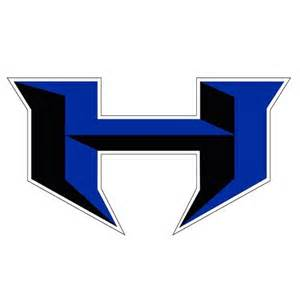
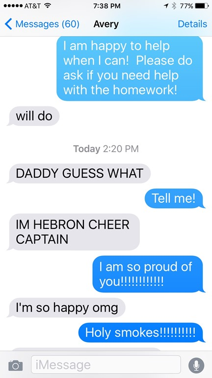

# A Proud Day to be a Dad

August 24, 2018

Thirteen years ago, I wrote about an amazing day that I had as a new father (A Great Day to be a Dad). 

Today, I had another one of those days.  I don’t often share personal stuff via my blog, but this one is one to remember. 

My son, Carson, picked up guitar this summer.  I was standing in his room watching him play Guitar Hero, showing me he could get through the expert levels.  While I have a lot of respect for fake plastic rock, I couldn’t help but point out that if he could keep up with the game on expert level, he could read tab and learn to play a real guitar.  An obsession was born, because I was right… he was playing songs that he knew within the first few days, and by end of summer he has surpassed any playing that I ever did.

This summer, my kids went to church camp at Allaso Ranch (just pointing out, my summer camp experience was never like this!), and was amazed by the teens playing in a praise band.  He was really moved by the music that kids his age were playing!  He really, really wanted to be part of the creative team at church.  However, this is Fellowship Church, a mega church in Texas.  He decided he wanted to get serious about guitar and get good enough to join the creative team.

He got in.  Tonight, he passed the tryout and is now a part of the creative team.  I love that he set his sights on something, worked for it, and achieved it.  He achieved one of his goals, and I am so proud!

It doesn’t end there.

My daughter, Avery, has been a competitive cheerleader since she was 5 (that’s 9 years).  She is amazing.  For those who aren’t familiar, there are really two sports in Texas:  football and cheerleading.  The football you probably know.  The cheerleading is not pom poms or the silly dance you see the Cowboys cheerleaders do.  Nope, this is gymnastics floor routines rivaling some of what you see in the Olympics coupled with team stunts that send my daughter 20 feet in the air as she performs full twists and flips.  She’s worked so hard at this, cheering for Spirit of Texas competitively and traveling all over the US competing (one of the top teams in the nation!) 

She is a freshman at the local high school, and she joined the high school cheerleading squad.  Hebron Hawks!  She has worked all summer on this as well, making sure she was ready for the squad. 

Today, my daughter text me. 

My daughter is captain of the cheerleading squad for 9th grade!  She has worked so hard, and I am so completely proud to see her achieve her goals!

Today is a great day to be a Dad.