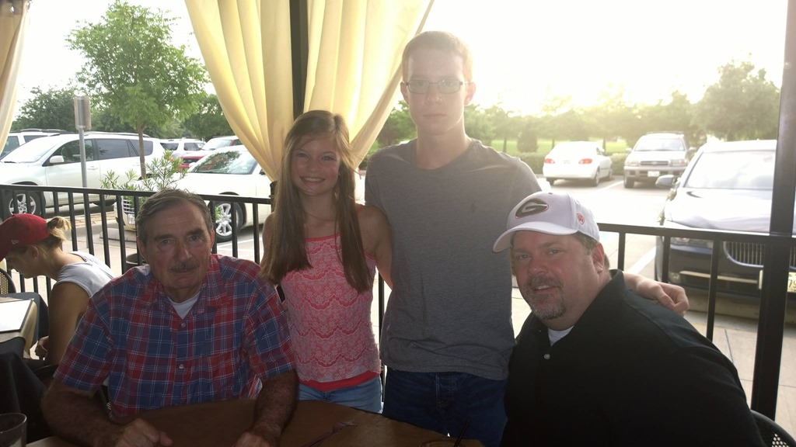
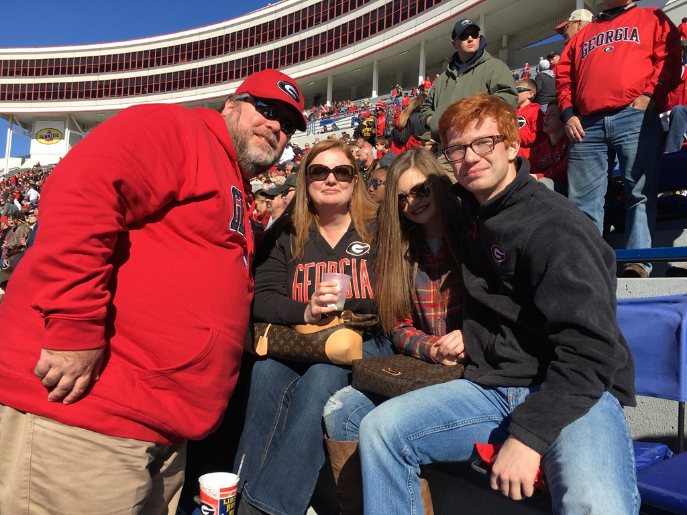
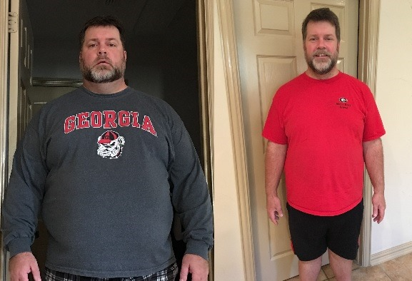
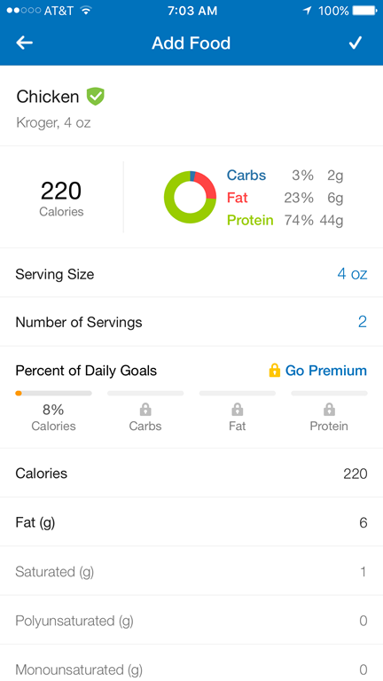
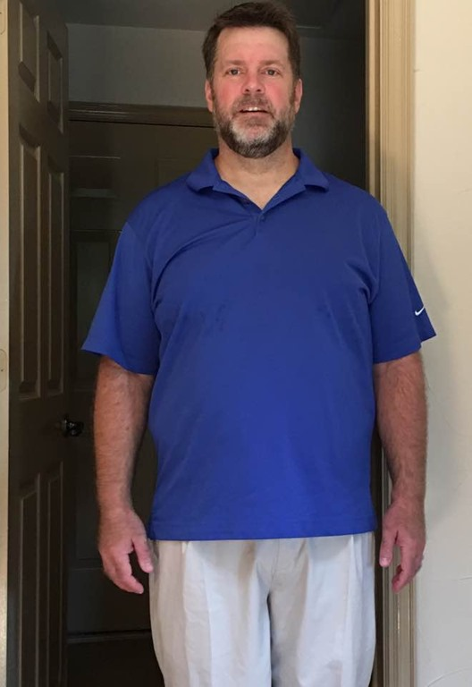

# Losing 100 Pounds in 5 Months

June 25, 2017

I have a lot of friends who have been asking me what the hell did I do to lose so much weight so fast.  This post is to try to capture everything.  I didn’t do some fad diet, buy any pills, have any surgery, or spend any money except for my gym membership. I made the decision, stuck with a plan, and didn’t deviate: eat less, move more, drink more water.  The first few parts of this post are a narrative about how I started. If you just want to see a sample routine, that’s at the end.

## Background

On January 1st this year, I decided to change my life.  I weighed 360 pounds, I was grossly out of shape, and I felt like time was running out.  I’d felt like this for a long time, to the point of near depression, but rather than try to get healthy I continued to make bad health decisions and continued gaining weight.  A few times I did try dieting, but I could never stick with anything long enough to see results.  Clothes no longer fit, and buying new clothes at a “big and tall” shop (you rarely see tall people in these) was infuriating due to the huge sizes that I had to purchase.

I love my wife, I love my kids, and I needed to be a better husband and father. My weight was in the way.

## Make The Decision

I got the chance of a lifetime to go to Ireland for a business trip.  While I was there, I went to see a dear friend, Derek Noonan.  He took me out to see the sights, including a trip to the amazing Cliffs of Moher.  It was stunning. We made the journey from Limerick to Burren in the morning.  We arrived at the the visitor’s center, and it certainly was beautiful, but to get a really good look you needed to walk up a fairly long path of stairs. I was winded from the first few stairs, and by the time we reached the observation deck I was spent.

Derek took me to a few other places that day. We climbed the inside of Bunratty Castle, and I couldn’t imagine walking one more step. He wanted to take me to see King John’s Castle in Limerick, but I was exhausted and couldn’t do it. Here I was, my first time to Ireland (I’ve wanted to visit my entire life) and I was too exhausted to see anything.

We talked that night at dinner about my friend’s wife had started a diet called keto.  I had seen Carl Franklin recently posting about a podcast he’d started (http://2ketodudes.com/) and the results he’d seen. More excuses, I tried Atkins and I couldn’t last but a few days, no thanks.

I was really excited for the flight home, I was able to get an international business class seat.  Traveling in style!  I sat down and… I didn’t fit. I could get my butt and torso in, but my arms were resting uncomfortably and wedged against the seat divider. It was uncomfortable as hell. It was on that plane ride that I’d made up my mind to do something, but I didn’t act on it for a few weeks.

 
My family purchased tickets to see my favorite football team, the Georgia Bulldogs, play in a bowl game.  We drove from Dallas, Texas to Memphis, Tennessee.  We rode in my wife’s car to get better gas mileage, and holy crap was it bad.  I was too fat to fit comfortably, with nowhere to put my arms.  We rented stadium seats, and they were worse than the bench seats because I was too fat to fit in them. I was too fat to sit with my family and had to sit one row in front of them to make sure my kids had enough room. If the plane flight home from Ireland was the decision point, this was the reinforcement.

I have a beautiful wife and two amazing kids, and I want to be here for a really, really long time. 

The point of this introduction… you have to make the decision, you have to find your motivation to start. Do not go into this with the mindset of “dieting”, which carries a temporary connotation. Think of this as deciding to change your lifestyle, changing the behavior that caused you to gain weight.  When you feel like giving up, you need to remember why you started, how you felt.

## The Start

My employer (Microsoft) offers an employee benefit to stay healthy, providing $800 yearly to be used towards the purchase of exercise equipment or a gym membership.  You should see the upstairs of my home, it’s littered with dusty exercise equipment I’ve accumulated over the years.  I plunked the money down at a gym.  I’d had gym memberships before, hired personal trainers before, and never seen results. I’d try it one more time.

While I was at the gym buying my membership, they told me that you could not exercise your way out of a bad diet, weight loss was 80% diet and just 20% exercise. I thought about Carl’s podcast and the results he had seen in a short timeframe… it was time. I’m done with feeling like this, I’m tired of feeling sick, I’m tired of my weight stopping me from enjoying life.  I need to change the diet. I started researching keto more earnestly.

January 2nd, I woke and went to the gym. I scheduled a personal trainer session to force myself to actually go to the gym. It was embarrassing, to say the least. Simple exercises (step up, step down, 15 times) were nearly impossible. Planks? I could hardly hold myself up, and pushups were out of the question. I had to walk up a flight of stairs to go up to the cardio equipment, and I could barely make it up the stairs. I scheduled another personal trainer session, and he gave me homework. Total work out time was maybe 30 minutes, and I was exhausted.

I got home, slightly defeated, but determined. I started the keto diet by cooking eggs and bacon for breakfast, something I frequently ate, but this time no toast, no orange juice. Just black coffee. After breakfast, I started drinking water.  I hadn’t drank water except to cure a hangover in a long time, opting for diet sodas or fruit juices. I was exhausted and took a long nap. I woke and, to my family’s shock, I had a salad for dinner: iceburg lettuce, a bit of shredded cheese, a boiled egg diced, and a grilled chicken breast, salt and pepper.

I did this for a week. Get up, go to the gym for an hour, get home and eat eggs and bacon, then sleep. Get up, eat a salad, then sleep. I was sleeping around 14 hours per day. I was a zombie when I was awake, I had zero energy and felt disgusting. At the end of the week, I weighed myself.  Holy crap! I lost 10 pounds in ONE WEEK. It was water weight, I had read that others saw the same thing when they started keto, but wow. I can muscle through this and make it to week two.

I kept going to the gym, kept eating eggs and bacon in the morning with black coffee, chicken for dinner.  Usually dinner was a salad, but sometimes I would just have grilled chicken breast with broccoli+butter or asparagus+olive oil. Occasionally, I’d have a steak, but it was mostly chicken.

## Progress

At the end of month 1, I had lost 25 pounds. I was done with my personal trainer sessions, but still going to gym almost every day. Workouts had greatly improved. I could walk up the stairs without the railing and without being winded, and my workout routine increased to lift weights for 1 hour then cardio for 30 minutes. I was already noticing a few changes: cardio wasn’t nearly as hard as it was when I started, I was increasing the amount of weight that I was lifting. The coolest thing was when I made it up the flight of stairs and wasn’t even winded. I could keep doing this. I posted to Facebook, and received overwhelming encouragement from friends and family. It was so cool, people were telling me I was inspiring them. I kept checking into Facebook, telling everyone I was at the gym. Honestly, that was more for me than it was for them. It was accountability.

At the end of month 2, I was down 50 pounds. I was working out at the gym when I traveled, sticking to my diet, and was starting to visibly see changes. I had moved from being confined to just the elliptical machine or stationary bike at the gym, I could now using the rowing machine and the Stairmaster. Thinking back to where I was when I visited the Cliffs of Moher, being able to last for 30 minutes on the Stairmaster was huge for me. I was no longer feeling exhausted during the day and could now make it through the day without a nap (well, during the week, but weekends I sometimes indulge).

At the end of month 3, I took my son with me to the gym. He works out nearly every day at school and is in amazing shape, so I struggled to keep up with him. We went to do pushups, and I said “sorry, buddy, I can’t do pushups, my gut is too heavy.” He said to just try, and I did.. and I did 12 pushups. I had no idea I could do them, I was so proud of myself. A very cool thing happened: My son was proud of me, too. I was overwhelmed thinking, “my kids are seeing me work this hard.”

 
End of month 4, I was down 85 pounds. I went from a size 5XL shirt down to a 2XL shirt, notched so many holes in my belt to tighten it that it wraps around to my back, even my shoes fit better.

Around this time, I hurt my arm at the gym (don’t overdo it, they say… well, pay attention, because it really effing hurts). I pulled or tore something in my forearm, now it hurts to lift a bottle of water, it hurts to push or pull anything, it hurts to walk and swing my arm. I stopped going to gym because it felt like I kept re-injuring it every time I went.  I stuck with my diet, but weight loss came to a screeching halt for a few weeks. I was frustrated. I went to do the thing that got me into this mess in the first place: I went to grab a beer. Remember that you aren’t doing a short-term diet, you are changing the behaviors that caused the weight gain.

I didn’t drink it, instead I went running.  RUNNING! Just a few months ago, I could barely get up a flight of stairs, and here I was running. I am still overweight, and I had to stop running to walk a few times. It took me about 20 minutes to run a mile.  Still, I ran most of it, and it felt amazing. The next day, I had some pent-up energy and asked my son if he wanted to go our bicycles around the neighborhood. I was so heavy before that I didn’t fit on the bike, but now I did and I could keep up with my son while riding around the neighborhood.  My daughter asked to ride bikes to the neighborhood pool, and we had a great time. Being lighter meant that I was enjoying more time with my kids.

Here we are, 5 1/2 months into this, and I am 100 pounds lighter. One hundred. When I started this, I couldn’t imagine losing 100 pounds, but then again, I couldn’t even imagine the first 10 pounds that I lost the first week. In the past, I’d always stopped a few weeks in when I didn’t see results. This time, I stuck with it. When I talk to people who want to lose weight, this is the part they are focused on: you lost so much weight! It didn’t happen overnight, it was a lot of trips to the gym, a lot of times eating a keto meal that I would much rather have had pizza and beer.

The point of this section is that it’s not just about losing weight, there are so many successes along the way to celebrate.

## The Rules

The keys to losing weight are the same as they always have been: eat less, move more, drink more water.  The problem with eating less is that it can be freaking impossible to get out of your own head.  I use the keto diet and, admittedly, a lot of will power.  The keto diet has you consume a very low amount of carbs and high fat, which makes you less hungry so you eat less. Fasting helps kick your metabolism back into gear, as does regular strenuous exercise. Drinking water not only helps you avoid being hungry but flushes everything from your body.

My rules are simple:

- Less than 20g total carbs per day. Usually closer to 10g.
- Only eat when you are hungry.
Stop eating when you are no longer hungry.
- Don’t eat after 7pm.
- Drink water.

To check carbs, I use an app called MyFitnessPal.com.  For many foods, you can scan the barcode and it will display the carbs for you, or you can search. It can even check the menu of the restaurant that you are at. There is a paid version, but the free version works fine for me. This is great, especially when you are getting started, to log the food to make sure you are actually staying under 20g carbs.

There is a calculator online at http://keto-calculator.ankerl.com.  Enter in weight, height, sex, protein, and carbs, and it will tell you how much you should be consuming based on your body type.  Here are my results:

| Metric               | Amount |
| -------------------- |:------:|
| Daily calorie intake |   1700 |
| Carbs	               |    15g |
| Protein              |   120g |
| Fat                  |   129g |

The only one of these that I actually focus on is the carbs, but I do occasionally check protein, especially when weight loss stalls.  I rarely ever hit 1700 calories, usually I am much lower than that. 

## Schedule

OK, the section some of you want to see since I get this one a lot… what the heck is your schedule?

Time | Activity
--- | ---
5:00am | Wake. Drink black coffee, check calendar. Work – process email, finish deliverables that are due.
8:00am | Go to gym. 5 minute warmup, 5 minute stretch, 50 minutes heavy lifting followed by 30 minutes cardio.
9:45am | Cook breakfast. Two eggs cooked in 1 tbsp butter + 4 pieces bacon or sausage.
10:15am | Back to work. Phone calls, coding, writing. Keep drinking a LOT of water throughout the day.
2:00pm | Light snack: handful of salted almonds, 1-2 ounces cheddar cheese. 
5:00pm | Dinner.
8:00pm | Bed.

My rule is that I don’t eat past 7pm and I don’t eat breakfast before 10am, providing a 15 hour fast every day.  Once every two weeks I do at least a 24-hour fast, occasionally I have done 48-hour fasts.  I am a royal jerk when I fast for that long, and I don’t wake up thinking, “I’m going to start a fast today.”  At breakfast, I ask myself if I am actually hungry, and if I’m not, I don’t eat then. At 2pm, I chug water to determine if I’m actually hungry or not. At dinner, I ask myself again if I am actually hungry. If I can make it through dinner and I am only a little hungry, I’ll push myself to wait until breakfast.

The first month or so, I frequently had to take a nap in the middle of the day. Part of that was because I was working out and my muscles were so sore that I didn’t sleep very well. Both of those passed, and I usually sleep 8-9 hours a night now, though I can still barely make it past 8pm.

## Sample Recipes

Here is a sample of recipes that I usually eat.

Omelet and meat: 2 eggs and 2 tbsp whole milk, salt and pepper, scrambled, cooked in 1 tbsp butter.  4 strips of bacon (I don’t drain them, I keep them dripping with fat) or 4 sausage patties. Store the leftover meats for meals for the next 2 days.

1 8-ounce chicken breast, grilled. Cover in Frank’s RedHot sauce, top with shredded cheddar cheese.  Side of broccoli (a whole bag), topped with butter and salt.

Pork rinds covered in shredded cheddar cheese, put in the oven for 5 minutes to melt the cheese.  Add 1/4 to 1/2 cup taco meat (McCormick taco seasoning, no reason other than that’s the one I like). Add jalapenos and shredded iceburg lettuce. Add Frank’s RedHot sauce.

8oz steak. Side of asparagus cooked in olive oil and salt.

Large bowl of mixed greens salad. Add 6-8 ounces chicken, 1 hard-boiled egg, shredded cheddar cheese, bacon pieces, walnuts, salt and pepper.

Hamburger patties, usually 2 of them, with a very small amount of ketchup (remember that ketchup has carbs), topped with pickles and cheddar cheese. Wrap in iceburg lettuce instead of a bun.

8-10 oz grilled flank steak, cut into fajita strips, shredded cheddar, small amounts of picante (watch carbs!) wrapped in iceburg lettuce instead of tortillas.

## Workouts

When I started working out, I hired a trainer for a few sessions just to get me started.   I knew I wasn’t going to be able to afford to have a trainer for very long, so I focused on developing a plan.  How many reps, how to stretch, how to increase over time.  What web sites to visit.  The trainer was helpful, but simply Googling with Bing for different workouts typically landed me at https://www.bodybuilding.com.  While I am no bodybuilder, it was helpful to get ideas for routines and even see videos of how to do the exercise correctly.

My workout routine is to do heavy lifting for about an hour, and cardio for 30 minutes. I don’t leave the gym until I’ve burned 1000 calories according to my Microsoft Band (or use a FitBit or Garmin or whatever works for you). The routine I’ve chosen is 6 days of strength training, alternating muscle isolation. Legs, lat/back, legs, triceps, legs, chest/biceps. 3 sets of 15 each exercise, 60-90 seconds between each set, with muscle failure on the 2nd and 3rd sets. I warmup, stretch, lift, do core exercises (planks, crunches, raises), then 30 minutes of cardio in the moderate range. The 7th day is a rest day. I had to build up to this routine, the first 2 weeks was primarily light weight with high repetitions to get my muscles used to moving. Stretching is key to avoid injury while improving flexibility.

Day	| Routine
--- | ---
Monday | Bicep/tricep – incline curls, pull-downs, tricep extensions,
Tuesday | Legs – extensions, curls, press, calf raise, calf extension, squat
Wednesday | Chest/lat
Thursday | Legs, planks
Friday | Shoulders/back
Saturday | Legs, planks

In case you aren’t quite sure what to do, consider hiring a trainer for a few sessions. Another choice is to spend some time reading and watching videos. A fantastic place is https://www.bodybuilding.com/exercises/finder/lookup/filter/muscle/id/10/muscle, you can filter by muscle group and then see different exercises and how to do them correctly. This site also has a ton of different articles that suggest workout routines, compares one approach to another, etc. 

A variation for weightlifting that I sometimes do is called “10 to 1’s”.  Lift weight and hold for 10 seconds, lift again and hold for 9 seconds, again and hold 8 seconds… all the way down to 1. If your muscles fail, wait for just 15 seconds and start where you left off. 

Cardio is usually the elliptical machine or StairMaster. On the elliptical machine, I put it on level 13 and use the random program, and focus on keeping my heart rate in the 145-170 range.  I sometimes have to focus to increase my pace to force my heart rate up.  On StairMaster, I set it to level 3 to start for 1 minute, then up to level 7-9 for 2 minutes, back down to 3 for 1 minute, back up to level 7-9 for 2 minutes, etc. I usually don’t have to watch to keep heart rate up on StairMaster, it’s usually a matter of counting down seconds until I can rest on level 3 and catch my breath for a second.

The combination of heavy weight resistance training followed by cardio increases the fat burn. 

As I am typing this, I am also gathering my phone, headphones, Microsoft Band, and keys to go to the gym.

## Summary

It hasn’t been easy. Sitting at dinner eating leftover chicken while my family has pizza, I’m not gonna lie… that sucks. Eating leftover vegetables while watching them enjoy french fries can be incredibly tempting. Going out to dinner and picking apart your meal to avoid the carbs can get really frustrating. Watching others drink beer or enjoy a dessert can be discouraging. My wife tries to plan meals that accommodate everyone, but often it’s a pain the ass to accommodate me.  I have to remind myself how awesome it feels to hit a milestone, to realize I can now do something I couldn’t before, to fit into something I haven’t for years, to feel better than I have in a very long time. 

I get terrible breath due to the ketones my body is expelling. No amount of teeth brushing or mouthwash seems to make it go away for long. I have to go to the bathroom very frequently, often at inconvenient times, because I drink so much water. I do get sick of not eating carbs, and walking through a grocery store is almost physically painful as you are literally surrounded by things you cannot enjoy, delicious breads and baked goods whose smell permeates the air. I miss sweets, and I really miss beer. No matter the downsides, nothing matters to me but feeling better than I used to, improving myself. Nothing tastes as good as losing weight feels.

My clothes don’t fit. My pants are now huge on me, I have to cinch my belt really tight. I have a few old shirts that I can now start fitting into again, but the majority of my wardrobe is way too big and looks like I borrowed someone else’s clothes. My belts look ridiculous as they wrap 1.5 times around me, with handmade holes demonstrating progress. It doesn’t make any sense to buy clothes now, I’m just going to have to buy more again soon as I continue to drop, and I can’t wait to buy them off the rack, at the mall, and not in a specialty shop for fat people.

This post is just as much a reminder to me as it is information for you. I post progress to Facebook partially to hear all the encouragement from friends, but more for accountability. I hear from so many people that I have inspired them, and friends ask how they might do the same. Living as a positive example is something I strive for but don’t often feel I live up to. This is something I can feel good about, and definitely can show my kids that hard work is required for the things you want in life.

I am now 100 pounds lighter, and it took me 5 months and 10 days to accomplish.

Challenge: when are you going to make the decision to start?

## Resources
https://www.ketogenicforums.com – Forums to ask questions, see what others are going through, get recipe ideas, or just simply vent.

https://www.myfitnesspal.com – App to count carbs. You have to track all the carbs in everything from vegetables and meats to drinks and condiments.

https://keto-calculator.ankerl.com – Keto calculator. If you aren’t seeing progress, go fill this out and compare with what you are doing.

https://www.bodybuilding.com/exercises/finder/lookup/filter/muscle/id/10/muscle – Discover workout routines without hiring a personal trainer.